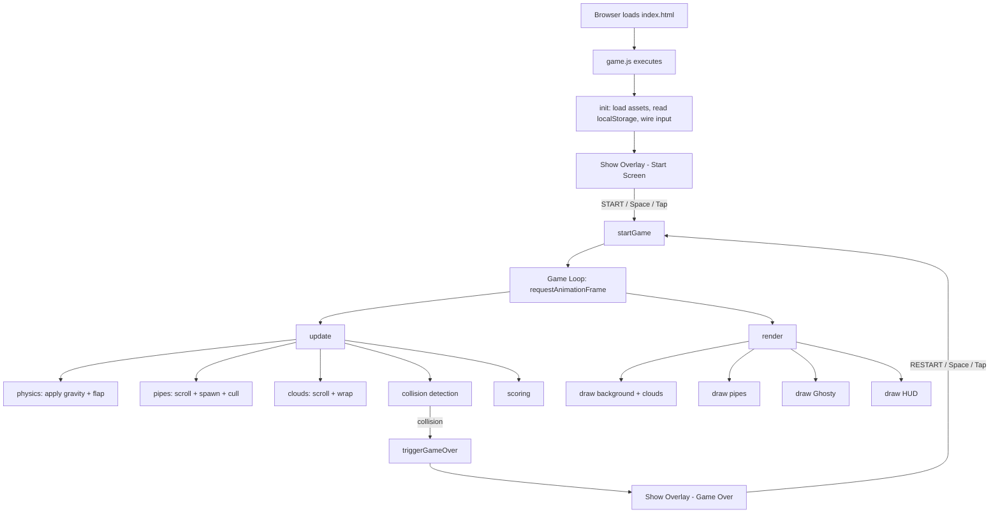

# Design Document: Flappy Kiro

## Overview

Flappy Kiro is a single-file, vanilla JavaScript browser game rendered on an HTML5 Canvas. The player controls a ghost sprite (Ghosty) that must navigate through an endless stream of pipe obstacles by tapping/clicking/pressing Space to flap upward against constant gravity. The game runs entirely client-side with no build step, no frameworks, and no server — just `index.html` + `game.js` + static assets.

The design follows a simple game-loop architecture: a `requestAnimationFrame` loop drives physics updates, collision checks, rendering, and score tracking on every frame. All game state lives in a single module-scoped state object. The HTML overlay (start screen / game-over screen) is a separate DOM element layered on top of the canvas via CSS absolute positioning.

### Key Design Decisions

- **No framework / no build step**: keeps the project zero-dependency and instantly runnable in any browser.
- **Single `game.js` module**: all logic in one file, organised into clearly separated functions (init, update, render, input handlers). This matches the existing `index.html` which already references `game.js`.
- **DOM overlay for menus**: the start/game-over screen is already implemented as a DOM `<div id="overlay">` in `index.html`. The game JS simply toggles its visibility and updates its text nodes — no canvas-drawn UI for menus.
- **Canvas HUD for in-game score**: the score bar is drawn directly on the canvas during active gameplay, keeping it pixel-perfect with the game world.
- **Axis-aligned bounding box (AABB) collision**: sufficient for this game's rectangular pipes and approximately rectangular ghost sprite. Simple and fast.

---

## Architecture

The game is structured as a single JavaScript module (`game.js`) with a clear separation of concerns across functions. There is no class hierarchy — plain objects and functions keep the code minimal and readable.



### Game States

The game has three logical states managed by a single `state.phase` string:

| Phase | Description |
|---|---|
| `"idle"` | Overlay visible, waiting for player to start |
| `"playing"` | Active gameplay, game loop running |
| `"gameover"` | Overlay visible with game-over info, waiting for restart |

---

## Components and Interfaces

### 1. Asset Loader

Responsible for loading all required assets before gameplay begins.

```
loadAssets() → Promise<{ img: HTMLImageElement, jumpSnd: HTMLAudioElement, gameoverSnd: HTMLAudioElement }>
```

- Loads `assets/ghosty.png` as an `Image`
- References the pre-existing `<audio>` elements from the DOM (`#snd-jump`, `#snd-gameover`)
- If the image fails to load, rejects with an error message identifying the failed asset
- On rejection, the init function catches the error and displays it in the overlay

### 2. Game State Object

A single plain object holds all mutable game state:

```js
{
  phase: "idle" | "playing" | "gameover",
  ghosty: GhostyState,
  pipes: PipeState[],
  clouds: CloudState[],
  score: number,
  highScore: number,
  framesSinceLastPipe: number,
  assets: { img, jumpSnd, gameoverSnd }
}
```

### 3. Ghosty (Player)

```js
GhostyState = {
  x: number,        // fixed horizontal position (left-side of canvas ~20%)
  y: number,        // current vertical centre position
  vy: number,       // vertical velocity (positive = downward)
  width: number,    // sprite render width (derived from image aspect ratio)
  height: number,   // sprite render height (fixed constant)
  rotation: number  // current rotation in radians (derived from vy)
}
```

**Physics constants** (tunable):
- `GRAVITY`: pixels/frame² downward acceleration
- `FLAP_VELOCITY`: pixels/frame upward impulse on flap
- `MAX_FALL_SPEED`: terminal velocity cap
- `ROTATION_FACTOR`: maps vy → rotation angle (clamped to ±MAX_ROTATION)

### 4. Pipe

```js
PipeState = {
  x: number,       // left edge of pipe column
  gapY: number,    // vertical centre of the gap
  scored: boolean  // true once Ghosty has passed this pipe
}
```

**Pipe constants**:
- `PIPE_WIDTH`: pixel width of each pipe column
- `PIPE_GAP`: pixel height of the gap between top and bottom pipe
- `PIPE_SPEED`: pixels/frame scroll speed
- `PIPE_INTERVAL`: pixels of scroll distance between spawns
- `PIPE_MARGIN`: minimum distance from canvas top/bottom edge for gap centre

The top pipe occupies `[0, gapY - PIPE_GAP/2]` and the bottom pipe occupies `[gapY + PIPE_GAP/2, canvasHeight - HUD_HEIGHT]`.

### 5. Cloud

```js
CloudState = {
  x: number,      // left edge
  y: number,      // top edge
  width: number,  // randomised width
  height: number  // randomised height
}
```

**Cloud constants**:
- `CLOUD_SPEED`: pixels/frame (slower than `PIPE_SPEED` for parallax)
- `CLOUD_COUNT`: fixed number of clouds maintained at all times

### 6. Renderer

Pure functions that take canvas context + state and draw to the canvas. No side effects beyond canvas draw calls.

```
renderBackground(ctx, canvas)
renderClouds(ctx, clouds)
renderPipes(ctx, pipes, canvas)
renderGhosty(ctx, ghosty, assets)
renderHUD(ctx, score, highScore, canvas)
```

### 7. Input Handler

Wires up `keydown` (Space), `click` (canvas), and `touchstart` (canvas) events. Each handler calls either `handleFlap()` or `handleStart()` depending on `state.phase`.

```
handleFlap()   // applies FLAP_VELOCITY, plays jump sound
handleStart()  // transitions phase idle→playing or gameover→playing
```

### 8. Collision Detector

```
checkCollision(ghosty, pipes, canvasHeight) → boolean
```

Returns `true` if:
- Ghosty's AABB overlaps any pipe rectangle (top or bottom), OR
- Ghosty's bottom edge (`y + height/2`) ≥ `canvasHeight - HUD_HEIGHT`

Uses a small inset on the AABB (e.g. 4px on each side) to give the player slight forgiveness on near-misses.

### 9. Score Tracker

```
updateScore(ghosty, pipes) → number  // returns new score
```

Iterates pipes; for each pipe where `!pipe.scored` and `ghosty.x > pipe.x + PIPE_WIDTH`, sets `pipe.scored = true` and increments score.

### 10. localStorage Interface

```
readHighScore() → number
writeHighScore(score: number) → void
```

Key: `"flappyKiro_highScore"`. Handles missing/corrupt values gracefully (defaults to 0).

---

## Data Models

### Canvas Sizing

The canvas is sized to `window.innerWidth × window.innerHeight` on load and on every `resize` event. A `resize` handler recalculates all position-dependent constants (e.g. Ghosty's initial `x`, pipe gap bounds) relative to the new dimensions.

### Coordinate System

- Origin `(0, 0)` is the top-left corner of the canvas.
- Positive Y is downward (standard canvas convention).
- Ghosty's `y` is its vertical centre.
- Pipe `gapY` is the vertical centre of the gap.

### HUD Layout

The HUD occupies a fixed-height strip at the bottom of the canvas:

```
┌─────────────────────────────────────────┐
│                                         │
│           (game world)                  │
│                                         │
├─────────────────────────────────────────┤  ← canvasHeight - HUD_HEIGHT
│  Score: X  |  High: X                  │  HUD strip
└─────────────────────────────────────────┘
```

`HUD_HEIGHT` = 36px. Pipes and collision detection treat `canvasHeight - HUD_HEIGHT` as the effective floor.

### Pipe Gap Bounds

```
gapY ∈ [PIPE_MARGIN + PIPE_GAP/2,  canvasHeight - HUD_HEIGHT - PIPE_MARGIN - PIPE_GAP/2]
```

This guarantees the full gap is always reachable and never clipped by the canvas edge or HUD.

### Game Reset

On restart, the state is reset to:
- `ghosty.y` = canvas centre, `ghosty.vy` = 0
- `pipes` = `[]`
- `clouds` = freshly randomised positions
- `score` = 0
- `framesSinceLastPipe` = 0

High score is NOT reset (persisted in localStorage).

---

## Correctness Properties

*A property is a characteristic or behavior that should hold true across all valid executions of a system — essentially, a formal statement about what the system should do. Properties serve as the bridge between human-readable specifications and machine-verifiable correctness guarantees.*


### Property 1: Canvas matches viewport on resize

*For any* browser viewport dimensions (width, height), after a resize event is processed, the canvas width and height SHALL equal the new viewport dimensions.

**Validates: Requirements 1.2**

---

### Property 2: Gravity accumulates velocity each frame

*For any* initial vertical velocity `vy`, after one physics update step, the new velocity SHALL equal `vy + GRAVITY` (clamped to `MAX_FALL_SPEED`).

**Validates: Requirements 3.1**

---

### Property 3: Rotation monotonically reflects velocity

*For any* two vertical velocities `vy1 < vy2`, the rotation assigned to `vy1` SHALL be less than or equal to the rotation assigned to `vy2` (more negative velocity = nose-up = smaller/more-negative rotation angle).

**Validates: Requirements 3.5**

---

### Property 4: Ghosty never exceeds top canvas boundary

*For any* upward flap applied to Ghosty, Ghosty's vertical position (top edge) SHALL never be less than 0 after the physics update.

**Validates: Requirements 3.6**

---

### Property 5: Pipe gap always within safe vertical bounds

*For any* spawned pipe, its `gapY` SHALL satisfy:
`PIPE_MARGIN + PIPE_GAP/2 ≤ gapY ≤ canvasHeight - HUD_HEIGHT - PIPE_MARGIN - PIPE_GAP/2`

**Validates: Requirements 4.2**

---

### Property 6: Pipes scroll at constant speed

*For any* pipe at position `x`, after one frame its position SHALL equal `x - PIPE_SPEED`.

**Validates: Requirements 4.3**

---

### Property 7: Off-screen pipes are removed

*For any* pipe whose `x + PIPE_WIDTH < 0`, that pipe SHALL NOT appear in the active pipe list after the next update step.

**Validates: Requirements 4.4**

---

### Property 8: Collision detection triggers game over

*For any* Ghosty position and pipe/canvas configuration where Ghosty's AABB overlaps a pipe rectangle OR Ghosty's bottom edge meets or exceeds the floor (`canvasHeight - HUD_HEIGHT`), the collision check SHALL return `true`.

**Validates: Requirements 5.1, 5.2**

---

### Property 9: Score increments exactly once per pipe passed

*For any* pipe that Ghosty passes (Ghosty's x > pipe.x + PIPE_WIDTH, no collision), the score SHALL increment by exactly 1, and the pipe SHALL be marked as scored so it is not counted again.

**Validates: Requirements 6.1**

---

### Property 10: HUD text matches score format

*For any* score value `s` and high score value `h`, the HUD text rendered SHALL contain the string `"Score: " + s` and `"High: " + h`.

**Validates: Requirements 6.2**

---

### Property 11: High score localStorage round-trip

*For any* high score value written to localStorage, reading it back SHALL return the same numeric value.

**Validates: Requirements 5.4, 6.3**

---

### Property 12: Cloud wraps to right edge when off-screen

*For any* cloud whose `x + cloud.width < 0` after a scroll update, the cloud SHALL be repositioned to `x ≥ canvasWidth` with a new randomised vertical position within the canvas bounds.

**Validates: Requirements 7.4**

---

### Property 13: Ghosty sprite aspect ratio preserved

*For any* canvas size, the rendered width-to-height ratio of the Ghosty sprite SHALL equal the natural width-to-height ratio of `assets/ghosty.png` (within floating-point tolerance).

**Validates: Requirements 9.4**

---

## Error Handling

### Asset Load Failure

- The `loadAssets()` function wraps image loading in a `Promise`. If the `Image` fires an `onerror` event, the promise rejects with a descriptive message (e.g. `"Failed to load: assets/ghosty.png"`).
- The `init()` function catches this rejection and updates the overlay message text to display the error, keeping the START button hidden so the player cannot start a broken game.
- Audio elements (`<audio>` tags) are pre-loaded by the browser; playback failures are caught with a `.catch()` on the `play()` promise and silently ignored (audio is non-critical).

### localStorage Errors

- `readHighScore()` wraps `localStorage.getItem` in a try/catch. If localStorage is unavailable (e.g. private browsing restrictions) or the stored value is non-numeric, it returns `0`.
- `writeHighScore()` wraps `localStorage.setItem` in a try/catch and silently ignores failures — the game continues without persistence rather than crashing.

### Canvas Context Unavailable

- If `canvas.getContext('2d')` returns `null` (unsupported browser), the game logs a console error and displays a static error message in the overlay.

### Resize During Gameplay

- A `resize` event during active gameplay recalculates canvas dimensions and re-derives all position-dependent values. Ghosty's `y` is clamped to the new canvas height to prevent it from being stranded off-screen.

---

## Testing Strategy

### PBT Applicability Assessment

Flappy Kiro is a vanilla JS game with pure physics functions, a collision detector, a score tracker, a localStorage interface, and rendering helpers. The core logic functions (physics update, collision check, score update, pipe spawning, cloud wrapping, HUD formatting, localStorage read/write) are pure or near-pure functions with clear input/output contracts. Input variation is meaningful for all of them. PBT **is applicable** for the logic layer.

Rendering functions (draw calls to canvas 2D context) are side-effect-only and not suitable for PBT — these will be covered by example-based tests using a mock canvas context.

### Property-Based Testing

**Library**: [fast-check](https://github.com/dubzzz/fast-check) (JavaScript, zero-dependency, runs in Node with no build step needed for tests).

**Configuration**: Minimum 100 runs per property (`numRuns: 100`).

**Tag format**: `// Feature: flappy-kiro, Property N: <property text>`

Each correctness property from the design document maps to exactly one property-based test:

| Property | Test description | Arbitraries |
|---|---|---|
| P1: Canvas resize | canvas dims = viewport dims | `fc.integer`, `fc.integer` for w/h |
| P2: Gravity accumulation | vy' = vy + GRAVITY (clamped) | `fc.float` for initial vy |
| P3: Rotation monotonicity | vy1 < vy2 → rot1 ≤ rot2 | `fc.tuple(fc.float, fc.float)` |
| P4: Top boundary | y never < 0 after flap | `fc.float` for initial y/vy |
| P5: Pipe gap bounds | gapY within safe range | `fc.integer` for canvasHeight |
| P6: Pipe scroll speed | x' = x - PIPE_SPEED | `fc.float` for initial x |
| P7: Pipe culling | off-screen pipes removed | `fc.array` of pipe positions |
| P8: Collision detection | overlap → true, no overlap → false | `fc.record` for ghosty/pipe positions |
| P9: Score increment | score +1 per pipe passed, once only | `fc.array` of pipe states |
| P10: HUD format | text contains "Score: s" and "High: h" | `fc.integer` for s and h |
| P11: localStorage round-trip | read(write(x)) = x | `fc.integer` for score |
| P12: Cloud wrap | off-screen cloud repositioned to right | `fc.record` for cloud state |
| P13: Aspect ratio | rendered w/h = natural w/h | `fc.integer` for canvas sizes |

### Unit / Example-Based Tests

Example-based tests cover:
- Asset load success and failure paths (mock `Image` with `onload`/`onerror`)
- Start screen overlay visibility on load
- START button click → overlay hidden, phase = "playing"
- Space key → flap applied, jump sound played
- Game over overlay content (message, score, high score, RESTART button)
- RESTART → full state reset, phase = "playing"
- Cloud speed < pipe speed constant relationship
- Canvas context unavailable error path

### Integration / Manual Tests

- Full game loop runs in a real browser without errors
- Touch events work on mobile devices
- High score persists across page reloads
- Window resize during gameplay does not crash or misplace Ghosty
